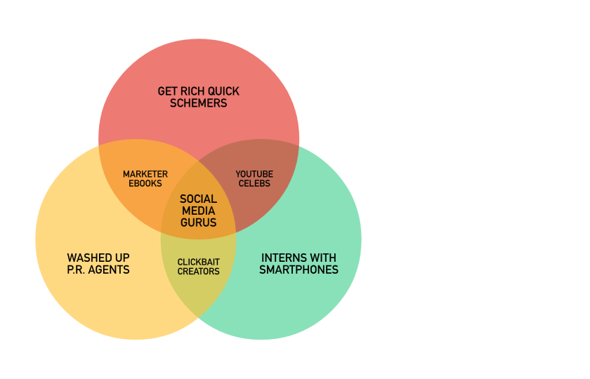

## Markdown

### _Italic_

To make a phrase italic in Markdown, you can surround words with an underscore (_ ).

### **Bold**

Similarly, to make phrases bold in Markdown, you can surround words with two asterisks ( ** ).

### Strikethrough

Strikethrough uses two tildes. ~~Scratch this.~~

### Headers

To make headers in Markdown, you preface the phrase with a hash mark (#).

### Links

To create an inline link, you wrap the link text in brackets ( [ ] ), and then you wrap the link in parenthesis ( ( ) ). 

The other link type is called a reference link. As the name implies, the link is actually a reference to another place in the document.  The "references" above are the second set of brackets: [another place] and [another-link]. At the bottom of a Markdown document, these brackets are defined as proper links to outside websites. An advantage of the reference link style is that multiple links to the same place only need to be updated once. For example, if we decide to make all of the [another place] links go somewhere else, we only have to change the single reference link.

[Google](https://www.google.com)

### Images

Images also have two styles, just like links, and both of them render the exact same way. The difference between links and images is that images are prefaced with an exclamation point ( ! ).
The first image style is called an inline image link. To create an inline image link, enter an exclamation point ( ! ), wrap the alt text in brackets ( [ ] ), and then wrap the link in parenthesis ( ( ) ). (Alt text is a phrase or sentence that describes the image for the visually impaired.)
<mark style="background-color: yellow">Note: the second link shoud fail, as you will not have a folder called __img__, nor the image file.</mark>




### Blockquotes

To create a block quote, all you have to do is preface a line with the "greater than" caret (>).
You can also place a caret character on each line of the quote. This is particularly useful if your quote spans multiple paragraphs. 

### Lists

To create an unordered list, you'll want to preface each item in the list with an asterisk ( * ). Each list item also gets its own line. Add a spacke after the asterix.

An ordered list is prefaced with numbers, instead of asterisks. Take a look at this recipe:

Occasionally, you might find the need to make a list with more depth, or, to nest one list within another. Have no fear, because the Markdown syntax is exactly the same. All you have to do is to remember to indent each asterisk one space more than the preceding item.

There's one more trick to lists and indentation that we'll explore, and that deals with the case of paragraphs. Suppose you want to create a bullet list that requires some additional context (but not another list). 

To create this sort of text, your paragraph must start on a line all by itself underneath the bullet point, and it must be indented by at least one space.

### Paragraph

This is what's known as a hard break; what our poetry asks for is a soft break. You can accomplish this by inserting two spaces after each new line.

### Code Blocks (Code fencing)

Use this to quote code inline with syntak highlighting!

```python
def loadCSV(filePath):
    dataframe = pd.read_csv(filePath, index_col=False, encoding='iso-8859-1', nrows=1000)
    datakeys = dataframe.keys()
    return dataframe, datakeys
``` 

### Color

New GitHub supported method:

<div class="text-purple"> Purple </div>  
<div class="text-red"> Red </div>  
<div class="text-green"> Green </div>  

### Links

[Markdown](https://daringfireball.net/projects/markdown/)

[Dingus Editor](https://spec.commonmark.org/dingus/)

[Babelmark2](https://johnmacfarlane.net/babelmark2/faq.html)

[Markdown Guide](https://www.markdownguide.org)

[More Markdown](https://dave.autonoma.ca/blog/2019/05/22/typesetting-markdown-part-1/)

[Yet Another Markdown Resource](http://idratherbewriting.com/2013/06/04/exploring-markdown-in-collaborative-authoring-to-publishing-workflows/)

[Wikipedia Example](https://en.wikipedia.org/wiki/Markdown#Example)

